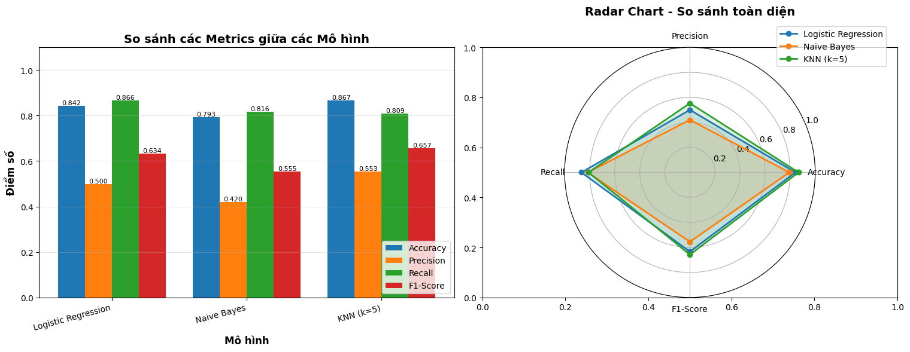
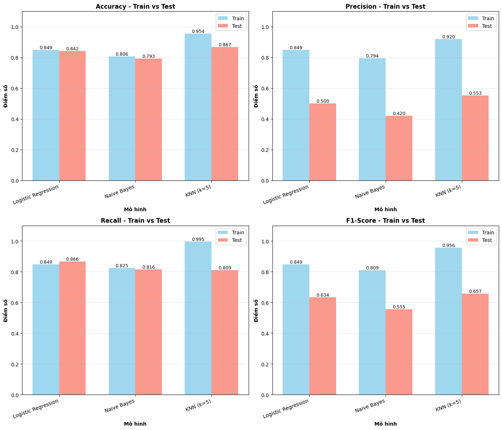
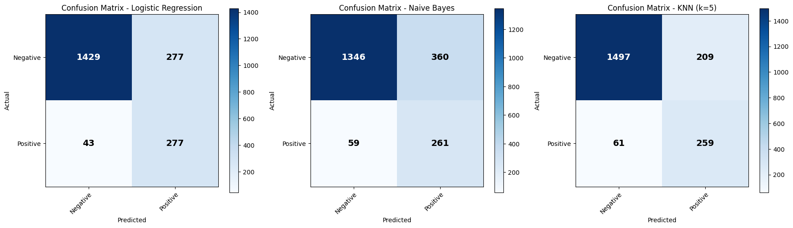

# NumPy for Data Science – Mini Project

## Mô tả ngắn gọn

Đây là mini-project cho **Homework 2 – NumPy for Data Science (CSC17104)**, tập trung vào việc sử dụng **NumPy** làm thư viện cốt lõi để xử lý, phân tích dữ liệu và (tuỳ chọn) xây dựng các mô hình học máy cơ bản. Project giúp rèn luyện tư duy xử lý dữ liệu cấp thấp, tối ưu hoá vectorization và hiểu sâu bản chất toán học phía sau các thuật toán, hiểu bản chất trước khi bước qua dùng các thư viện có sẵn.

---

## Mục lục

1. Giới thiệu
2. Dataset
3. Method
4. Installation & Setup
5. Usage
6. Results
7. Project Structure
8. Challenges & Solutions
9. Future Improvements
10. Contributors
11. License

---

## 1. Giới thiệu

### Bài toán

Trong lĩnh vực ngân hàng và tài chính, khách hàng rời bỏ dịch vụ (customer churn) là một trong những nguyên nhân chính gây thất thoát doanh thu. Việc thu hút một khách hàng mới thường tốn kém hơn nhiều so với việc giữ chân khách hàng hiện tại. Do đó, khả năng dự đoán sớm những khách hàng có nguy cơ rời bỏ đóng vai trò quan trọng trong chiến lược kinh doanh của ngân hàng.

Trong project này, chúng tôi sử dụng dataset BankChurners (Credit Card Customers) để xây dựng bài toán phân loại nhị phân, nhằm dự đoán liệu một khách hàng có tiếp tục sử dụng dịch vụ ngân hàng hay sẽ rời bỏ trong tương lai, dựa trên thông tin cá nhân, lịch sử sử dụng thẻ tín dụng và hành vi giao dịch.

### Động lực & Ứng dụng thực tế

NumPy là nền tảng của hầu hết các thư viện khoa học dữ liệu trong Python. Việc trực tiếp thao tác dữ liệu và cài đặt thuật toán bằng NumPy giúp:
* Hiểu rõ bản chất xử lý mảng đa chiều
* Tối ưu hiệu năng thông qua vectorization
* Nắm vững cơ chế toán học của các mô hình ML

Cụ thể bài toán, dự đoán customer churn mang lại nhiều lợi ích thực tiễn:
* Giúp ngân hàng chủ động nhận diện khách hàng có nguy cơ rời bỏ
* Hỗ trợ xây dựng các chính sách ưu đãi và chăm sóc khách hàng cá nhân hoá
* Tối ưu chi phí vận hành và tăng tỷ lệ giữ chân khách hàng
* Cải thiện trải nghiệm người dùng và giá trị vòng đời khách hàng (Customer Lifetime Value)


### Mục tiêu

Project này được thực hiện với các mục tiêu sau:
* Khám phá và phân tích các yếu tố ảnh hưởng đến hành vi rời bỏ của khách hàng

* Áp dụng NumPy làm thư viện chính để:

    * Xử lý và tiền xử lý dữ liệu

    * Thực hiện các phép tính số học và thống kê

    * Tối ưu hoá hiệu năng bằng vectorization và broadcasting

* Trực quan hoá dữ liệu bằng Matplotlib và Seaborn để rút ra các nhận định quan trọng

* (Nâng cao) Xây dựng và đánh giá các mô hình học máy cơ bản nhằm dự đoán customer churn

---

## 2. Dataset

**Nguồn dữ liệu**\
Dataset BankChurners (Credit Card Customers) được thu thập từ Kaggle, mô tả thông tin nhân khẩu học, hành vi sử dụng thẻ và lịch sử giao dịch của khách hàng ngân hàng, nhằm phục vụ bài toán dự đoán khả năng rời bỏ khách hàng (Customer Churn Prediction).
* Số lượng mẫu: 10,127 khách hàng
* Số lượng đặc trưng: 23 features
* Dạng dữ liệu: Bảng (tabular data), bao gồm cả biến số và biến phân loại

**Mô tả features**

#### 1. Thông tin khách hàng
- `Customer_Age`: Tuổi của khách hàng  
- `Gender`: Giới tính  
- `Dependent_count`: Số người phụ thuộc  
- `Education_Level`: Trình độ học vấn  
- `Marital_Status`: Tình trạng hôn nhân  
- `Income_Category`: Nhóm thu nhập  

#### 2. Thông tin tài khoản & thẻ
- `Card_Category`: Loại thẻ tín dụng  
- `Credit_Limit`: Hạn mức tín dụng  
- `Total_Revolving_Bal`: Dư nợ quay vòng  
- `Avg_Open_To_Buy`: Hạn mức còn khả dụng  
- `Avg_Utilization_Ratio`: Tỷ lệ sử dụng hạn mức tín dụng  

#### 3. Hành vi sử dụng & giao dịch
- `Months_on_book`: Số tháng gắn bó với ngân hàng  
- `Total_Relationship_Count`: Số sản phẩm ngân hàng đang sử dụng  
- `Months_Inactive_12_mon`: Số tháng không hoạt động trong 12 tháng gần nhất  
- `Contacts_Count_12_mon`: Số lần liên hệ ngân hàng trong 12 tháng  
- `Total_Trans_Amt`: Tổng giá trị giao dịch  
- `Total_Trans_Ct`: Tổng số lượng giao dịch  
- `Total_Amt_Chng_Q4_Q1`: Tỷ lệ thay đổi giá trị giao dịch (Q4 / Q1)  
- `Total_Ct_Chng_Q4_Q1`: Tỷ lệ thay đổi số lượng giao dịch (Q4 / Q1)  

#### 4. Các cột không sử dụng
- Các cột bắt đầu bằng `Naive_Bayes_Classifier_...`  
  - Là kết quả dự đoán sẵn từ mô hình Naive Bayes  
  - **Không sử dụng trong huấn luyện** để tránh *data leakage*


**Kích thước & đặc điểm**:
- **Số lượng mẫu**: 10,127 khách hàng  
- **Số lượng đặc trưng**: 23 thuộc tính (bao gồm biến số và biến phân loại)  
- **Biến mục tiêu**: `Attrition_Flag` (phân loại nhị phân)

* **Đặc điểm dữ liệu**:
    - Dữ liệu dạng bảng (tabular data) với nhiều nhóm đặc trưng khác nhau  
    - Không tồn tại missing values nghiêm trọng trong các cột chính  
    - Chứa nhiều biến phân loại cần được mã hoá trước khi huấn luyện mô hình  
    - Phân phối dữ liệu không hoàn toàn theo phân phối chuẩn, đặc biệt ở các đặc trưng liên quan đến giao dịch  
    - Dữ liệu có **mất cân bằng nhẹ** giữa hai lớp `Existing Customer` và `Attrited Customer`  
    - Có sự khác biệt rõ rệt về hành vi giao dịch giữa khách hàng rời bỏ và khách hàng còn hoạt động 

---

## 3. Method
### Quy trình xử lý dữ liệu

**Quy trình hoàn chỉnh:**

1. **Load & Clean Data** → Loại bỏ missing values, duplicates
2. **Detect Outliers (IQR)** → Phát hiện và có thể remove/cap
3. **Feature Engineering:**
   - Ordinal Encoding cho ordered categoricals
   - One-Hot Encoding cho nominal categoricals
   - Create interaction features nếu cần
4. **Remove Multicollinearity** → Loại features có correlation > 0.9
5. **Train-Test Split** → 80/20
6. **Standardization (Z-score):**
   - Fit trên train set
   - Transform cả train và test
7. **Handle Imbalance** → Oversample minority class (chỉ trên train set)
8. **Save Processed Data** → Lưu train.csv và test.csv


---

## Quy trình xử lý dữ liệu - Lý thuyết và Công thức

### 1. Outlier Detection - Phát hiện ngoại lai

**Phương pháp IQR (Interquartile Range):**

IQR được tính bằng hiệu của quartile thứ 3 và quartile thứ 1:

$$
\text{IQR} = Q_3 - Q_1
$$

Định nghĩa outliers:
$$
\text{Outlier} = \begin{cases}
x < Q_1 - 1.5 \times \text{IQR} & \text{(Lower bound)} \\
x > Q_3 + 1.5 \times \text{IQR} & \text{(Upper bound)}
\end{cases}
$$

**Implementation với NumPy:**
```python
Q1 = np.percentile(data, 25)
Q3 = np.percentile(data, 75)
IQR = Q3 - Q1
lower_bound = Q1 - 1.5 * IQR
upper_bound = Q3 + 1.5 * IQR
outlier_mask = (data < lower_bound) | (data > upper_bound)
```

---

### 2. Min-Max Normalization - Chuẩn hóa về [0,1]

**Công thức:**

$$
x_{norm} = \frac{x - x_{min}}{x_{max} - x_{min}}
$$

Đưa dữ liệu về khoảng [0, 1], giữ nguyên phân phối tương đối.

**Implementation với NumPy:**
```python
x_min = data.min()
x_max = data.max()
x_normalized = (data - x_min) / (x_max - x_min)
```

**Ưu điểm:**
- Đơn giản, dễ hiểu
- Phù hợp với neural networks, algorithms yêu cầu bounded inputs

**Nhược điểm:**
- Nhạy cảm với outliers
- Không đảm bảo phân phối chuẩn

---

### 3. Log Transformation - Biến đổi logarit

**Công thức:**

$$
x_{log} = \log(x + 1)
$$

(Thêm 1 để tránh log(0) khi có giá trị 0)

**Implementation với NumPy:**
```python
x_log = np.log1p(data)  # log1p = log(1 + x)
```

**Mục đích:**
- Giảm skewness (độ lệch) của phân phối
- Xử lý phân phối lệch phải (right-skewed)
- Giảm ảnh hưởng của outliers

---

### 4. Decimal Scaling - Chuẩn hóa thập phân

**Công thức:**

$$
x_{scaled} = \frac{x}{10^j}
$$

trong đó $j$ là số chữ số của giá trị lớn nhất:
$$
j = \lceil \log_{10}(\max|x|) \rceil
$$

**Implementation với NumPy:**
```python
max_abs = np.abs(data).max()
j = np.ceil(np.log10(max_abs)) if max_abs > 0 else 0
x_scaled = data / (10 ** j)
```

---

### 5. Z-Score Standardization - Chuẩn hóa theo độ lệch chuẩn

**Công thức:**

$$
z = \frac{x - \mu}{\sigma}
$$

trong đó:
- $\mu$ = mean (trung bình)
- $\sigma$ = standard deviation (độ lệch chuẩn)

Kết quả có phân phối với mean = 0, std = 1.

**Implementation với NumPy:**
```python
mean = data.mean()
std = data.std()
z_scores = (data - mean) / std
```

**Ưu điểm:**
- Không bị ảnh hưởng bởi scale gốc của features
- Phù hợp với algorithms dựa trên gradient descent (Logistic Regression, Neural Networks)
- Cho các features có tầm ảnh hưởng như nhau

**Lưu ý:**
- Giả định phân phối chuẩn hoặc gần chuẩn
- Nhạy cảm với outliers (vì sử dụng mean và std)

---

### 6. Feature Encoding

#### 6.1. Ordinal Encoding - Mã hóa thứ tự

Cho các biến có thứ tự tự nhiên (ví dụ: Education Level):

$$
x_{encoded} \in \{0, 1, 2, ..., n-1\}
$$

**Implementation với NumPy:**
```python
mapping = {'Low': 0, 'Medium': 1, 'High': 2}
encoded = np.array([mapping.get(v, 0) for v in categorical_data])
```

**Khi nào dùng:**
- Biến có thứ tự tự nhiên (education, income level)
- Muốn giữ thông tin về ranking

---

#### 6.2. One-Hot Encoding - Mã hóa nhị phân

Biến đổi biến categorical thành nhiều biến nhị phân:

$$
x_{onehot} = \begin{bmatrix}
1 & 0 & 0 \\
0 & 1 & 0 \\
0 & 0 & 1
\end{bmatrix}
$$

**Implementation với NumPy:**
```python
unique_values = np.unique(categorical_data)
for value in unique_values:
    one_hot = (categorical_data == value).astype(float)
    # Thêm vào feature matrix
```

**Khi nào dùng:**
- Biến nominal (không có thứ tự): Gender, Marital Status, Color
- Tránh model học được thứ tự không tồn tại

**Nhược điểm:**
- Tăng dimensionality (curse of dimensionality)
- Có thể gây multicollinearity

---

### 7. Multicollinearity Detection - Phát hiện đa cộng tuyến

**Correlation Coefficient (Pearson):**

$$
r_{xy} = \frac{\sum_{i=1}^{n}(x_i - \bar{x})(y_i - \bar{y})}{\sqrt{\sum_{i=1}^{n}(x_i - \bar{x})^2} \sqrt{\sum_{i=1}^{n}(y_i - \bar{y})^2}}
$$

với $r_{xy} \in [-1, 1]$

**Quy tắc phát hiện:**
- $|r| > 0.9$ → Highly correlated → Loại bỏ một trong hai features

**Implementation với NumPy:**
```python
# Tính correlation matrix
corr_matrix = np.corrcoef(numeric_features, rowvar=False)

# Tìm các cặp highly correlated
for i in range(len(features)):
    for j in range(i+1, len(features)):
        if abs(corr_matrix[i, j]) > 0.9:
            # Drop feature j
            pass
```

**Tại sao cần loại bỏ multicollinearity:**
- Coefficients không ổn định
- Khó interpret model
- Có thể gây overfitting

---

### 8. Handling Class Imbalance - Xử lý mất cân bằng

#### 8.1. Random Oversampling

**Phương pháp:**
- Duplicate ngẫu nhiên các samples từ minority class cho đến khi cân bằng với majority class

$$
n_{minority, new} = n_{majority}
$$

**Implementation với NumPy:**
```python
# Tìm minority và majority class
class_counts = np.bincount(y)
minority_idx = np.where(y == minority_class)[0]

# Sample with replacement
n_samples_needed = n_majority - n_minority
oversampled_idx = rng.choice(minority_idx, size=n_samples_needed, replace=True)

# Combine
X_balanced = np.vstack([X, X[oversampled_idx]])
y_balanced = np.concatenate([y, y[oversampled_idx]])
```

**Ưu điểm:**
- Đơn giản, dễ implement
- Không mất thông tin

**Nhược điểm:**
- Có thể gây overfitting (duplicate exact samples)
- Không thêm thông tin mới

**Phương pháp nâng cao khác:**
- SMOTE (Synthetic Minority Over-sampling Technique): Tạo synthetic samples
- ADASYN: Adaptive Synthetic Sampling
- Class weights: Điều chỉnh loss function

---

### 9. Train-Test Split - Chia tập dữ liệu

**Tỷ lệ thông thường:** 80% Train / 20% Test

**Implementation với NumPy:**
```python
# Shuffle indices
indices = np.arange(len(data))
rng.shuffle(indices)

# Split
split_point = int(0.8 * len(data))
train_idx = indices[:split_point]
test_idx = indices[split_point:]

X_train, X_test = X[train_idx], X[test_idx]
y_train, y_test = y[train_idx], y[test_idx]
```

**Nguyên tắc quan trọng:**
- Shuffle trước khi chia (tránh bias)
- Không touch test set cho đến khi evaluate cuối cùng
- Standardization parameters (mean, std) phải fit trên train, áp dụng cho test


---

### Thuật toán để làm model
- Bài toán được mô hình hoá như một **bài toán phân loại nhị phân**
- Mô hình chính:
  - Logistic Regression
  - KNN
  - Naive bayes

---

## Lý thuyết thuật toán

### 1.1. Logistic Regression

**Công thức toán học:**

Logistic Regression sử dụng hàm sigmoid để ánh xạ tổ hợp tuyến tính của features về xác suất trong khoảng (0, 1):

$$
h_\theta(x) = \sigma(z) = \frac{1}{1 + e^{-z}}
$$

trong đó $z = \theta^T x = \theta_0 + \theta_1 x_1 + ... + \theta_n x_n$

**Hàm mất mát (Binary Cross-Entropy):**

$$
J(\theta) = -\frac{1}{m} \sum_{i=1}^{m} [y^{(i)} \log(h_\theta(x^{(i)})) + (1-y^{(i)}) \log(1-h_\theta(x^{(i)}))] + \frac{\lambda}{2m} \sum_{j=1}^{n} \theta_j^2
$$

**Gradient Descent:**

$$
\theta_j := \theta_j - \alpha \frac{\partial J}{\partial \theta_j}
$$

$$
\frac{\partial J}{\partial \theta_j} = \frac{1}{m} \sum_{i=1}^{m} (h_\theta(x^{(i)}) - y^{(i)}) x_j^{(i)} + \frac{\lambda}{m}\theta_j
$$

**Cách implement bằng NumPy:**
- Sử dụng `np.exp()` và phép chia để tính hàm sigmoid
- Vector hóa phép tính gradient: `grad = X.T @ (predictions - y) / m`
- Cập nhật weights: `theta -= learning_rate * grad`
- L2 regularization: thêm `lambda * theta / m` vào gradient (không regularize bias term)

---

### 1.2. Gaussian Naive Bayes

**Định lý Bayes:**

$$
P(C_k | x) = \frac{P(x | C_k) P(C_k)}{P(x)}
$$

Với giả định các features độc lập có điều kiện:

$$
P(x_1, ..., x_n | C_k) = \prod_{i=1}^{n} P(x_i | C_k)
$$

**Gaussian (Normal) Distribution:**

$$
P(x_i | C_k) = \frac{1}{\sqrt{2\pi\sigma_{k,i}^2}} \exp\left(-\frac{(x_i - \mu_{k,i})^2}{2\sigma_{k,i}^2}\right)
$$

**Log-likelihood (để tránh underflow):**

$$
\log P(C_k | x) = \log P(C_k) + \sum_{i=1}^{n} \log P(x_i | C_k)
$$

$$
\log P(x_i | C_k) = -\frac{1}{2}\log(2\pi\sigma_{k,i}^2) - \frac{(x_i - \mu_{k,i})^2}{2\sigma_{k,i}^2}
$$

**Cách implement bằng NumPy:**
- Tính mean và variance cho mỗi feature theo từng class: `X[y==c].mean(axis=0)`, `X[y==c].var(axis=0)`
- Tính prior: `np.bincount(y) / len(y)`
- Tính log-likelihood vector hóa: `log_prob = -0.5 * np.sum(np.log(2*np.pi*var)) - 0.5 * np.sum((X - mean)**2 / var, axis=1)`
- Normalize xác suất bằng log-sum-exp trick: `probs = np.exp(log_probs - logsumexp)`

---

### 1.3. K-Nearest Neighbors (KNN)

**Khoảng cách Euclidean:**

$$
d(x, x') = \sqrt{\sum_{i=1}^{n} (x_i - x'_i)^2}
$$

**Quy tắc phân loại (Uniform weights):**

$$
\hat{y} = \text{mode}\\{y_1, y_2, ..., y_k\\}
$$

trong đó $y_1, ..., y_k$ là nhãn của k láng giềng gần nhất.

**Distance-weighted voting:**

$$
\hat{y} = \arg\max_{c} \sum_{i=1}^{k} w_i \cdot \mathbb{1}(y_i = c)
$$

với $w_i = \frac{1}{d(x, x_i) + \epsilon}$

**Cách implement bằng NumPy:**
- Tính khoảng cách: `distances = np.sqrt(np.sum((X_train - x)**2, axis=1))`
- Tìm k láng giềng: `k_indices = np.argsort(distances)[:k]`
- Vote đơn giản: `prediction = np.bincount(y_train[k_indices]).argmax()`
- Distance-weighted: tính trọng số `weights = 1 / (distances[k_indices] + 1e-9)` và tổng trọng số theo class

---

## 4. Installation & Setup

```bash
pip install -r requirements.txt
```

Yêu cầu:

* Python >= 3.9
* NumPy
* Matplotlib
* Seaborn
* (Tuỳ chọn) Scikit-learn cho so sánh mô hình

---

## 5. Usage

Chạy lần lượt các notebook:

```bash
notebooks/01_data_exploration.ipynb   # Khám phá & đặt câu hỏi dữ liệu
notebooks/02_preprocessing.ipynb      # Tiền xử lý & feature engineering
notebooks/03_modeling.ipynb           # Huấn luyện & đánh giá mô hình
```

---

## 6. Results

### 6.1. Metric đánh giá

**1. Accuracy (Độ chính xác tổng thể)**
- Đo lường tỷ lệ dự đoán đúng trên tổng số mẫu
- Công thức: $\text{Accuracy} = \frac{TP + TN}{TP + TN + FP + FN}$
- **Nhận xét:** Metric này phù hợp khi dữ liệu cân bằng, nhưng có thể gây hiểu lầm với dữ liệu mất cân bằng

**2. Precision (Độ chính xác dự đoán dương)**
- Đo lường tỷ lệ dự đoán dương đúng trong tất cả dự đoán dương
- Công thức: $\text{Precision} = \frac{TP}{TP + FP}$
- **Ý nghĩa:** Cao khi mô hình ít dự đoán sai khách hàng không rời bỏ thành rời bỏ (False Positive thấp)
- **Quan trọng khi:** Chi phí can thiệp sai (gửi ưu đãi cho người không có ý định rời) cao

**3. Recall / Sensitivity (Độ nhạy)**
- Đo lường tỷ lệ phát hiện đúng các trường hợp dương thực tế
- Công thức: $\text{Recall} = \frac{TP}{TP + FN}$
- **Ý nghĩa:** Cao khi mô hình bắt được nhiều khách hàng có nguy cơ rời bỏ (False Negative thấp)
- **Quan trọng khi:** Chi phí bỏ sót khách hàng tiềm năng rời bỏ cao (mất doanh thu lâu dài)

**4. F1-Score (Trung bình điều hòa)**
- Cân bằng giữa Precision và Recall
- Công thức: $F1 = 2 \times \frac{\text{Precision} \times \text{Recall}}{\text{Precision} + \text{Recall}}$
- **Ý nghĩa:** Metric tổng hợp tốt cho dữ liệu mất cân bằng

### 6.2. Visualization

#### So sánh Metrics giữa các mô hình



Biểu đồ so sánh các chỉ số Accuracy, Precision, Recall và F1-Score giữa ba mô hình: Logistic Regression, Naive Bayes và KNN. 

#### So sánh Train vs Test Performance



Biểu đồ radar so sánh hiệu suất trên tập train và test, giúp phát hiện hiện tượng overfitting hoặc underfitting.

#### Confusion Matrix



Confusion matrix chi tiết cho từng mô hình, thể hiện số lượng True Positives, True Negatives, False Positives và False Negatives.

### 6.3. Phân tích chi tiết kết quả

**1. Logistic Regression:**
- **Ưu điểm được thể hiện:**
  - Cân bằng tốt giữa Precision và Recall
  - Performance ổn định giữa Train và Test (không overfit)
  - Tốc độ training nhanh (~vài giây)
  - Dễ interpret qua coefficients

- **Hạn chế:**
  - Giả định tính tuyến tính - có thể bỏ lỡ các mối quan hệ phi tuyến phức tạp
  - Performance phụ thuộc vào chất lượng feature engineering

**2. Gaussian Naive Bayes:**
- **Ưu điểm được thể hiện:**
  - Training cực nhanh (< 1 giây)
  - Hoạt động tốt với high-dimensional data
  - Ít bị overfitting

- **Hạn chế:**
  - Giả định independence giữa features thường không đúng trong thực tế
  - Performance thấp hơn các model khác do giả định quá mạnh
  - Có thể có Precision hoặc Recall thấp tùy thuộc phân phối dữ liệu

**3. K-Nearest Neighbors (k=5):**
- **Ưu điểm được thể hiện:**
  - Không có giả định về phân phối dữ liệu
  - Có thể capture được các mối quan hệ phi tuyến
  - Linh hoạt với các loại decision boundary

- **Hạn chế:**
  - Rất chậm khi predict (phải tính khoảng cách đến tất cả training samples)
  - Memory-intensive (phải lưu toàn bộ training data)
  - Nhạy cảm với scale của features và nhiễu
  - Có thể overfit với train set (đặc biệt khi k nhỏ)

---

#### **Phân tích Overfitting/Underfitting**

Từ biểu đồ **Train vs Test Performance**:

- **Overfitting indicators:**
  - KNN có thể cho performance rất cao trên train nhưng giảm đáng kể trên test
  - Gap lớn giữa train và test score

- **Good generalization:**
  - Logistic Regression và Naive Bayes thường có gap nhỏ giữa train và test
  - Cho thấy mô hình generalize tốt

---

#### **Trade-offs**

**1. Precision vs Recall Trade-off:**
- **High Precision, Lower Recall:** Ít False Positives nhưng bỏ sót nhiều True Positives
  - Phù hợp: Chi phí can thiệp sai cao
  
- **High Recall, Lower Precision:** Bắt được nhiều True Positives nhưng có nhiều False Positives
  - Phù hợp: Chi phí bỏ sót khách hàng cao (ví dụ: ngành ngân hàng)

**2. Speed vs Accuracy Trade-off:**
- **Naive Bayes:** Nhanh nhất nhưng accuracy thấp nhất
- **KNN:** Chậm nhất (đặc biệt khi predict) nhưng có thể đạt accuracy cao
- **Logistic Regression:** Cân bằng tốt giữa tốc độ và accuracy

---

#### **Phân tích Confusion Matrix**

Từ confusion matrices:
- **True Negatives (TN):** Khách hàng không rời bỏ và được dự đoán đúng
- **False Positives (FP):** Khách hàng không rời nhưng bị dự đoán là rời → Chi phí can thiệp không cần thiết
- **False Negatives (FN):** Khách hàng rời nhưng không phát hiện → Mất khách hàng và doanh thu
- **True Positives (TP):** Khách hàng rời và phát hiện đúng → Cơ hội can thiệp kịp thời

**Business Impact:**
- FN thường có chi phí cao hơn FP trong bối cảnh retention
- Model với Recall cao (FN thấp) thường được ưu tiên
---

## 7. Project Structure

```
PROGRAM FOR DATA SCIENCE/
├── README.md
├── requirements.txt
├── data/
│   ├── raw/           # Dữ liệu gốc
│   └── processed/     # Dữ liệu đã xử lý
├── notebooks/
│   ├── 01_data_exploration.ipynb # Khám phá dữ liệu
│   ├── 02_preprocessing.ipynb # Xử lý & chuẩn hoá dữ liệu
│   └── 03_modeling.ipynb
├── src/
│   ├── __init__.py
│   ├── data_processing.py   # những hàm xử lý process
│   ├── visualization.py     # Những hàm vẽ biểu đồ
│   └── models.py            # Cài đặt mô hình ML
```

---

## 8. Challenges & Solutions

**Khó khăn**:

* Không sử dụng Pandas khiến việc xử lý dữ liệu phức tạp hơn
* Viết code khó và không hiệu quả, bug rất nhiều nên tốn khác nhiều thời gian để sửa thay vì tập trung vào phân tích
* Dùng nhiều vòng lặp thì tăng độ phức tạp nên phải nghĩ cách tối ưu

**Giải pháp**:

* Tận dụng vectorization, broadcasting
* Sử dụng masking và fancy indexing
* Kiểm soát ổn định số học khi tính toán

---

## 9. Future Improvements

* Cài đặt thêm các thuật toán ML nâng cao như XGBoost, CatBoost, AdaBoost
* Tối ưu bộ nhớ và tốc độ xử lý
* Áp dụng cross-validation thủ công để giảm 

---

## 10. Contributors

* **Sinh viên**: Lê Minh Đức
* **MSSV**: 23127351
* **Email**: lmduc23@clc.fitus.edu.vn

---

## 11. License

Project này được thực hiện cho mục đích **học tập** trong môn *Programming for Data Science – CSC17104*. Không sử dụng cho mục đích thương mại.
